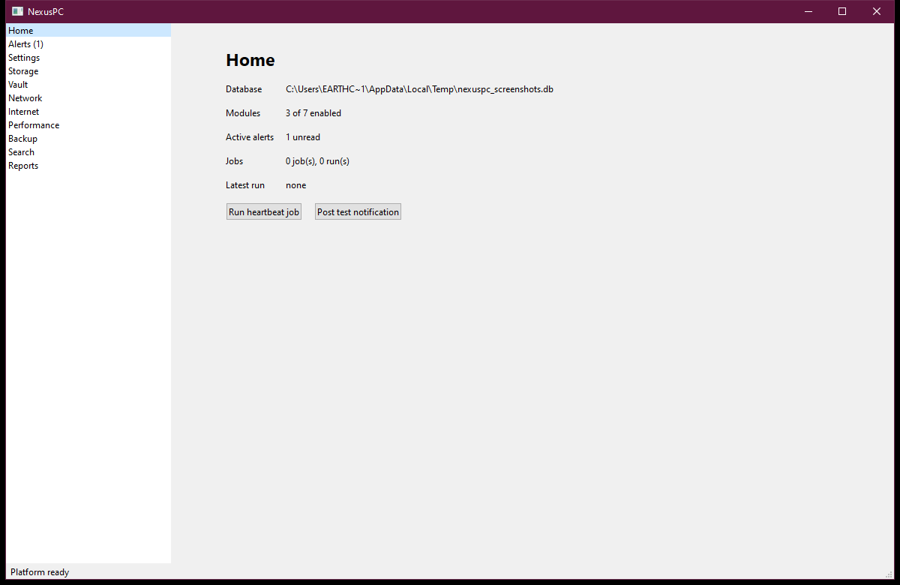
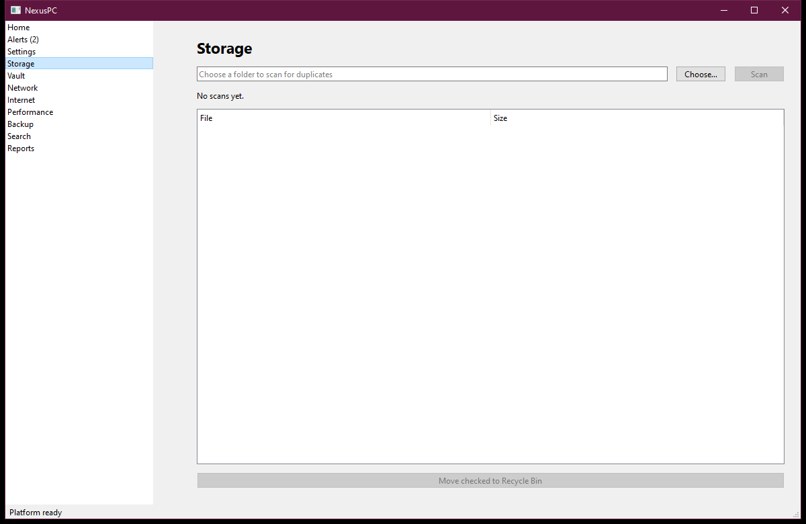
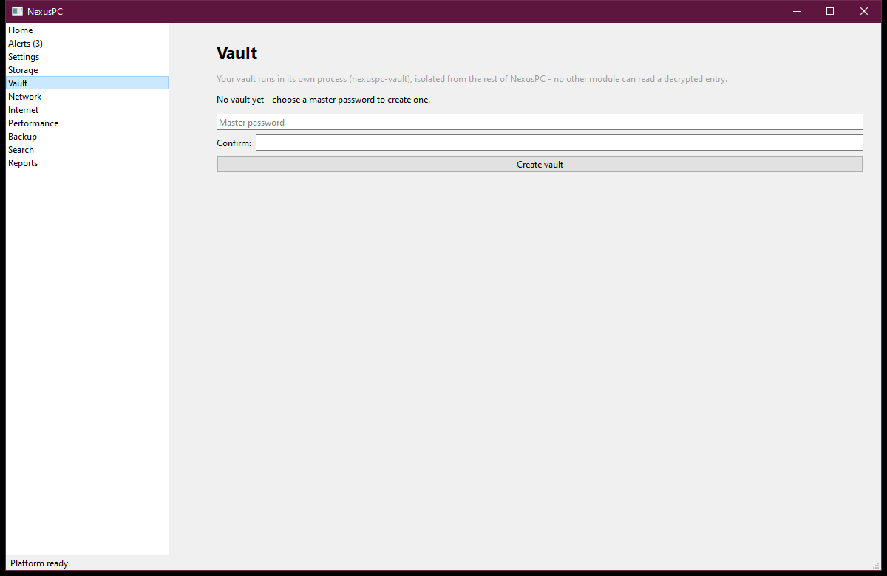
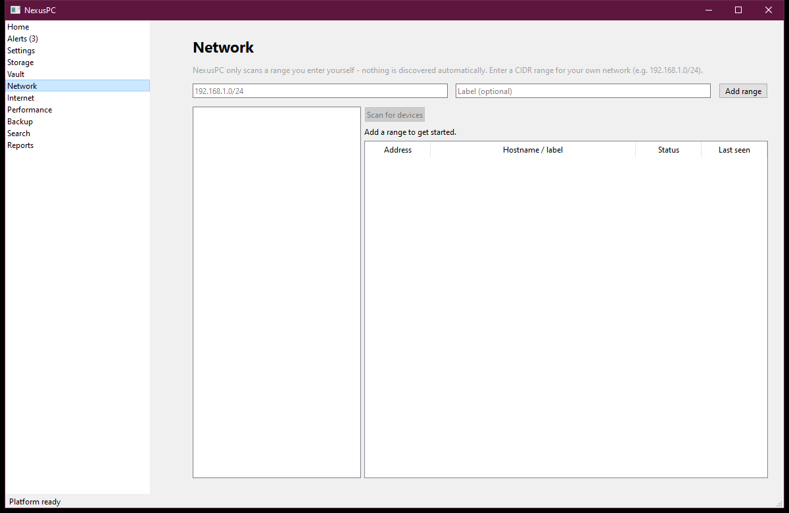
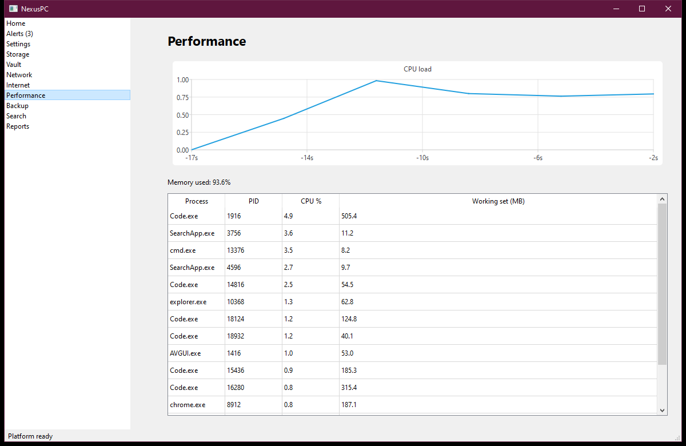
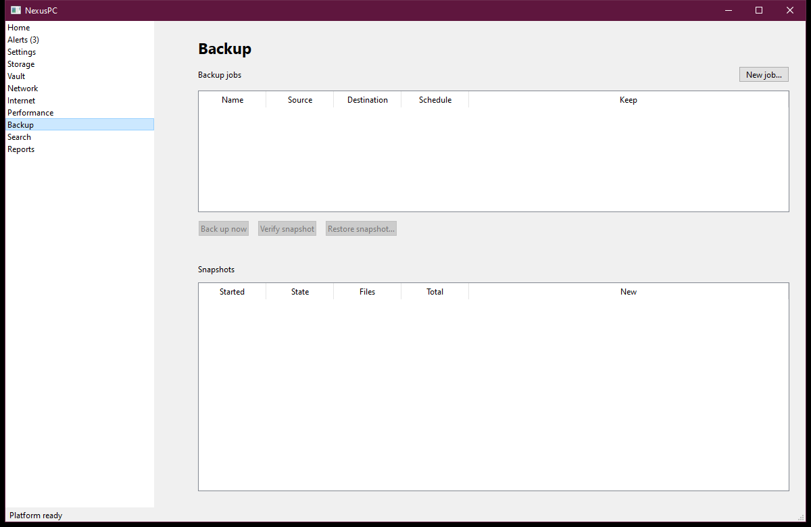
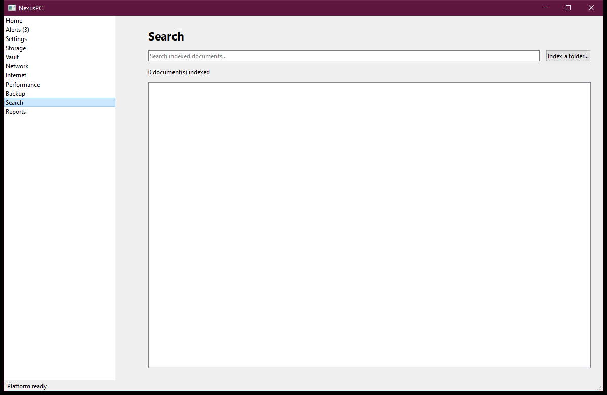
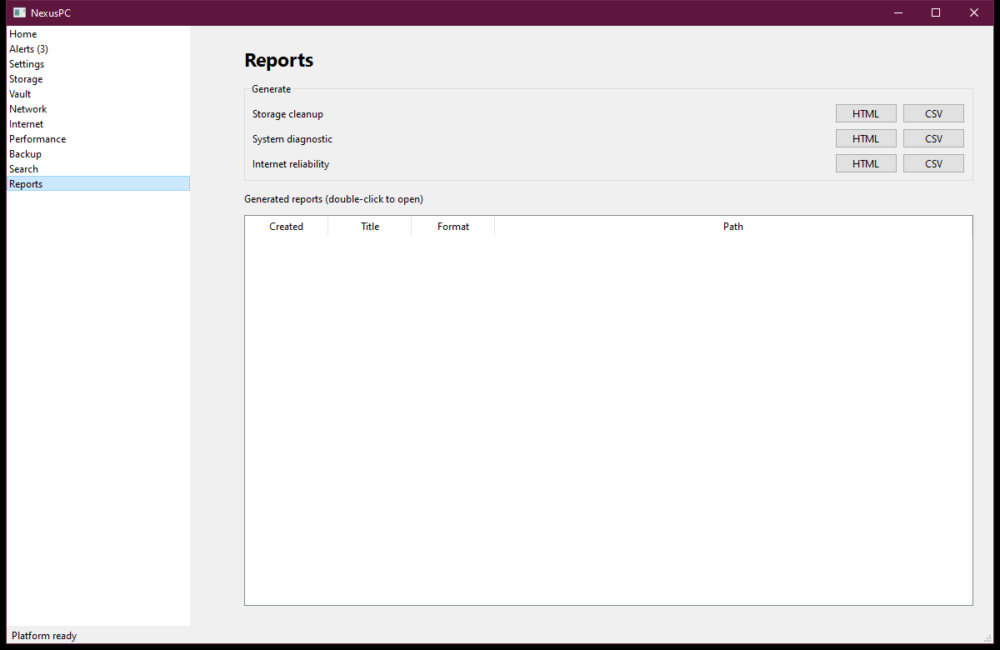
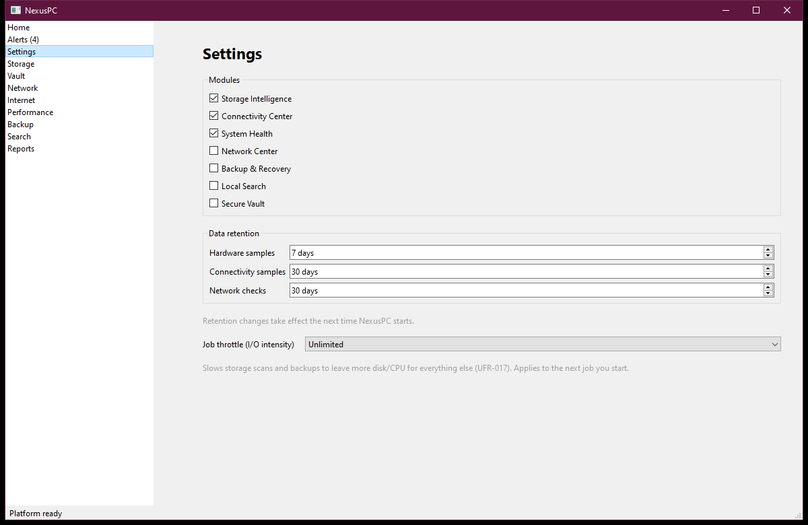

# NexusPC user guide

NexusPC is a local-first Windows desktop app for managing and protecting one
computer: duplicate-file cleanup, a password vault, network device
discovery, internet reliability tracking, hardware health, backups, and
local file search - one dashboard instead of seven separate tools.

Everything runs on your machine. Nothing is uploaded anywhere, network
scanning only ever looks at a range you type in yourself, and remote
management is off by default (see `docs/UFR_CONFORMANCE.md` if you want the
full list of guarantees NexusPC makes and how each is implemented).

## Installing

Download `NexusPC-Setup-<version>.exe` and run it. You'll be asked whether
to install just for yourself (no administrator prompt) or for everyone on
this PC (needs administrator). Either way, NexusPC creates its database,
reports, and vault file under `%APPDATA%\NexusPC` the first time it runs -
uninstalling never touches that folder, so your data survives a
reinstall or upgrade.

Building the installer yourself: see `packaging/windows/README.md`.

> Windows SmartScreen may warn about the installer or the app itself - there
> is no code-signing certificate for this project yet. See
> `packaging/windows/README.md` for what to do if that's ever fixed.

## The window

The left-hand list is your navigation: every module gets one page, and
**Home** is a one-screen summary of all of them - which modules are
enabled, how many alerts are waiting, and the most recent job. **Alerts**
(with an unread count next to it) is where every module posts notifications
- a threshold breach, a device going offline, a module failing to start -
in one place, so you never have to go looking for them module by module.

## Storage - find and clean up duplicate files

Pick a folder, click **Scan**, and NexusPC hashes its way down from cheap
checks (file size) to expensive ones (a full BLAKE3 hash) so it only pays
the expensive check on files that are actually likely duplicates. Results
show up as a checkbox tree, with a bar showing what fraction of the
scanned data is reclaimable - review what it found, check the copies you
don't need, and **Move checked to Recycle Bin** sends them there (not a
permanent delete - Windows' own undo applies). "Auto-rescan this folder
when files change" watches it in the background and re-scans on its own
after edits settle down, instead of needing a manual re-scan.

## Vault - passwords and secure notes

The vault is deliberately not "just another module": it runs in its own
process (`nexuspc-vault.exe`), spawned the first time you open this page,
so a bug anywhere else in NexusPC has no way to read a decrypted entry. The
first time, you'll choose a master password to create the vault; after
that, unlocking asks for it again. Once unlocked you can browse, add, edit,
and delete entries, generate a random password, and run a health check that
flags weak, reused, and old passwords. Each entry has a Kind: **Password**
(username/password/URL/notes, the default) or **Secure note** (just a
title and a note body - the username/password/URL fields disappear for
this kind, since they don't apply). **Export…** seals a full copy of the
vault to a second file, protected by the same master password, for backing
it up separately from the rest of NexusPC's data. Copying a password to
the clipboard clears it again after 30 seconds. The vault locks itself
automatically after 5 minutes idle, independent of whether the rest of the
app is even open.

Full design/threat-model writeup: `docs/security/vault-threat-model.md` and
`docs/adr/0003-vault-security-architecture.md`.

## Network - devices on your network

NexusPC never scans a network on its own. Type in a range for your own
network (the placeholder shows the format, e.g. `192.168.1.0/24`), give it
a label, and only then does **Scan for devices** do anything - it pings
every address in that range and lists what answered, and resolves each
one's MAC address (via ARP) alongside a quick check of common service
ports (web, file sharing, remote desktop). Re-scan any time to refresh
who's online; each known device also gets pinged automatically in the
background so status/last-seen stays current between scans.

## Internet - is your connection actually working?

Tracks a handful of well-known targets (DNS resolvers, a DNS-resolution
check, a captive-portal check) over time - uptime, packet loss, and
jitter per target, plus an hourly download-speed trend (a rough
indicator, not a formal benchmark) - so it can tell "the internet is
down" apart from "my PC can't reach the router": a one-line
PC/router/internet status alongside the outage list and latency chart.

## Performance

Live CPU/memory charts and a sortable process table, sampled every few
seconds. Threshold alerts (e.g. "disk nearly full") show up in Alerts the
moment they're crossed, not just when you happen to be looking at this page.

## Backup

Create a job (source folder, destination, how many snapshots to keep, and
an optional schedule like "every 6h" - schedules survive an app restart).
**Back up now** copies new/changed file content into a content-addressed
store, so unchanged files across snapshots cost no extra space - **Verify**
re-hashes everything in a snapshot to catch bit rot, and **Restore** pulls
a snapshot (or one file from it) back out.

## Search

**Index a folder…** to make its text-like files (source code, Markdown,
config files, plain text - about three dozen extensions - plus `.docx`
content) searchable; the search box then gives ranked results with
snippets as you type, and double-clicking a result opens the file.
Results also flag when a file is part of the latest backup or a known
duplicate group. "Auto re-index this folder when files change" keeps the
index current without needing to click Index again. PDF content isn't
indexed yet.

## Reports

Every module that has something worth writing down - system diagnostics,
internet reliability, a storage-cleanup summary, the network device list,
a backup run - registers a report here. Generate one as HTML (to read) or
CSV (to import elsewhere); both are also saved to disk under your NexusPC
data folder.

## Settings

- **Modules**: turn any module on or off independently. Storage,
  Connectivity, and System Health are on by default; the rest you opt into.
- **Data retention**: how long hardware samples, connectivity samples, and
  network checks are kept before old rows get pruned - each on its own
  schedule, changes take effect on the next launch.
- **Job throttle**: when a storage scan or backup is running, this slows it
  down on purpose (Unlimited/High/Normal/Low) to leave more disk/CPU for
  everything else. If you start a second heavy job while one's already
  running, NexusPC asks first rather than piling on silently.

## Where things live

- Database, reports, and the vault file: `%APPDATA%\NexusPC`.
- Nothing NexusPC does requires administrator rights day-to-day; the
  installer itself is the only place elevation is ever optional (for
  an all-users install).
